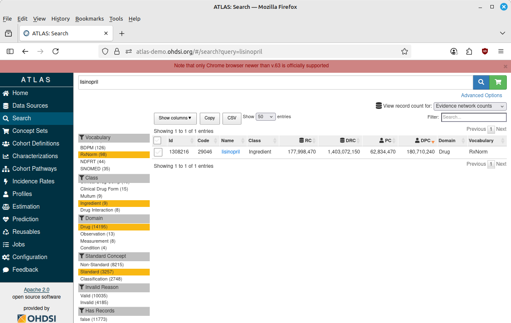
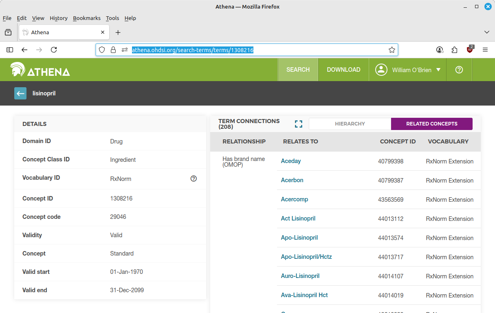

# Introduction

The purpose of this research notebook is to demonstrate a reproducible program to assess the incidence rate of angioedema within 1 year of first drug exposure to lisinopril. 

# R libraries and setup 

If one wanted to `source()` this code from another script, the tangled R code is in ./lisinoprilScript.R 

This study uses renv for reproducibility. Re-create the R library by running: 

```{r eval = FALSE}

renv::restore()

```

```{r output=FALSE, message=FALSE, warning=FALSE}

rm(list=ls())

library(DatabaseConnector)
library(SqlRender)
library(CohortGenerator)
library(Capr)
library(CohortIncidence)
library(Eunomia)
library(knitr)

cdmSchema <- "main"
cohortSchema <- "main" 
cohortTableName <- "lisinopril"

```

# Database connection 

```{r warning=FALSE, message = FALSE, results='asis'}

connectionDetails <- getEunomiaConnectionDetails()

connection <- connect(connectionDetails)

```

# Eunomia customization

I am using the synthetic Eunomia CDM for testing. But there is a problem... Eunomia was designed for running the model GI bleed study and the very small concept table does not even have an entry for our target and outcome. I will hack Eunomia and insert the concept name "lisinopril" in place of diclofenac, and "angioedema" in place of gastrointestinal hemorrhage. Of course we would never mutate the data in a real CDM. 

```{r warning=FALSE, message = FALSE, results='asis'}

renderTranslateQuerySql(connection, 
                        "select concept_id,
                           concept_name,
                           standard_concept
                         from @cdmSchema.concept 
                         where concept_name like 'diclofenac'",
                        cdmSchema = cdmSchema) |>
  kable() 

renderTranslateQuerySql(connection, 
                        "select concept_id,
                           concept_name,
                           standard_concept
                         from @cdmSchema.concept 
                        where concept_name like '%gastro%'",
                        cdmSchema = cdmSchema) |>
  kable()

```

```{r warning=FALSE, message = FALSE, results='asis', output=FALSE}

renderTranslateExecuteSql(
  connection,
  "update @cdmSchema.concept
   set concept_name = 'Lisinopril'
   where concept_id = 1124300;",
  cdmSchema = cdmSchema)

renderTranslateExecuteSql(
  connection,
  "update @cdmSchema.concept
   set concept_name = 'Angioedema'
   where concept_id = 192671;",
  cdmSchema = cdmSchema)

```

# Find standard concept ids

There are two excellent OHDSI options at this point. I could use Atlas or Athena to search the standard vocabulary, Atlas to build concept sets, define cohorts, then execute the study. I believe Atlas is the approach we should be focusing on to attract researchers into the community. 

Here is how I would identify the exposure standard concept if I were using the graphical tools:





My preference though is to do this programatically with Hades. I know that lisinopril is an ACE commonly prescribed to treat hypertension and a few other conditions. The OHDSI standard vocabulary for drugs is RxNorm, so I will search for rows in the concept table where vocabulary_id is "RxNorm," the domain_id is "Drug," the concept_class_id is "Ingredient," and the standard_vocabulary column is "S". 

I will use the ontological mappings of the concept_ancestor table to obtain all drug exposures containing ingredient lisinopril. The utility of this cannot be overstated. In the EHR, the drug exposures of interest will be represented by a vast number of generic vs. brand names, doses, and combinations with other active ingredients that would take a great amount of time and cost to curate. In an international collaboration, I would have to worry that some of my colleagues might call the drug λισινοπρίλη, and others call it 赖诺普利. In an OHDSI study, we all agree it is standard concept_id 1308216, completely disambiguated. 

My use of the SqlRender functions in these queries is so that other organizations can run it as-is without refactoring for different SQL dialects.

## Lisinopril standard concept 

In my modified Eunomia, this will not return the "real" concept_id for lisinopril that I noted above.

```{r warning=FALSE, message = FALSE, results='asis'}

renderTranslateQuerySql(
  connection, 
  "select concept_id,
     concept_name,
     standard_concept 
   from @cdmSchema.concept 
   where concept_name = 'Lisinopril'
     and domain_id = 'Drug'
     and concept_class_id = 'Ingredient'
     and standard_concept = 'S'",
  cdmSchema = cdmSchema) |>
  kable()

lisinoprilConcept <- 1124300

```

What are the descendants? I always review these (either in Athena or with SQL queries) to get a sense of:

- sheer number of formulations/brands we are dealing with

- did the mapping team make any mistakes?

- single vs. combo drugs

- doses or IV/intramuscula route that might indicate drug exposure in ED, as opposed to typical Rx exposure

```{r warning=FALSE, message = FALSE, results='asis'}

renderTranslateQuerySql(
  connection,
  "select descendant_concept_id, 
     concept_name descendant_concept_name
   from @cdmSchema.concept_ancestor a
   left join @cdmSchema.concept b
     on a.descendant_concept_id = b.concept_id
   where ancestor_concept_id = @lisinoprilConcept",
  cdmSchema = cdmSchema,
  lisinoprilConcept = lisinoprilConcept) |>
  kable() 

```

Results: there are no descendants of the target concept in Eunomia, but many in a real CDM

## Angioedema standard concept

I use the same approach to look for the outcome concept. Angioedema is something that would be diagnosed, so I know to look in the condition domain for a standard SNOMED code. 

```{r warning=FALSE, message = FALSE, results='asis'}

renderTranslateQuerySql(
  connection, 
  "select concept_id,
     concept_name,
     standard_concept
   from @cdmSchema.concept 
   where concept_name = 'Angioedema'
     and domain_id = 'Condition'
     and standard_concept = 'S'",
  cdmSchema = cdmSchema) |>
  kable()

angioedemaConcept <- 192671

```

Looking at Athena, I noticed there are some angioedema descendants we may want to exclude. For example, is hereditary angioedema an adverse event attributable to ACE-I? That is a decision for a clinician to make, but I will do so here for demonstration.  

```{r warning=FALSE, output=FALSE, results='asis'}

renderTranslateQuerySql(
  connection,
  "select descendant_concept_id, 
     concept_name descendant_concept_name
   from @cdmSchema.concept_ancestor a
   left join @cdmSchema.concept b
     on a.descendant_concept_id = b.concept_id
   where ancestor_concept_id = @angioedemaConcept",
  cdmSchema = cdmSchema,
  angioedemaConcept = angioedemaConcept) |>
  kable() 

hereditaryAngioedemaConcept <- 4307793

```

# Concept sets 

Here I use the standard concepts to build the concept set, which is a collection of concepts with additional data on whether the concepts are to be excluded, whether to use descendants of the standard concept, or to use other concepts that are mapped to it. 

I like to pull the concept details after creating the concept set so they are clearly labelled. It is not crucial, but a nice Capr convenience. 

## Lisinopril concept set

```{r message = FALSE, warning = FALSE}

lisinoprilCs <- cs(descendants(lisinoprilConcept), 
                   name = 'linosoprilCs') |>
  getConceptSetDetails(connection, cdmSchema) 

str(lisinoprilCs@Expression)

```

## Angioedema concept set

The @isExcluded slot in this S4 class means that we want to exclude that hereditary angioedema concept. 

```{r message=FALSE, warning=FALSE}

angioedemaCs <- cs(descendants(angioedemaConcept),
                   exclude(hereditaryAngioedemaConcept),
                   name = 'angioedemaCs') |>
  getConceptSetDetails(connection, cdmSchema)

str(angioedemaCs@Expression)
 
```

# Cohort definitions 

## Lisonipril cohort

The target cohort is people with their first drug exposure to the ingredient lisinopril. Exit is 1 year after first exposure, so they remain in the cohort whether or not they continue the medication. To have reasonable assurance it is their first exposure, I will use an attribute to the cohort entry query that requires one year of prior continuous observation. I also include an age attribute because I presume this is not a pediatric study. 

I would ask here if we want to exclude from the cohort anyone with prior angioedema or other drug exposures that are associated with angioedema risk, but the exercise does not specify so I will leave attrition as NULL. Over-exclusion is to be done with caution because it can introduce selection bias, so in this case I would rather do a stratified analysis or sensitivity analysis. 

```{r output=FALSE, message=FALSE, warning=FALSE}

targetCohort <- cohort(
  entry = entry(drugExposure(lisinoprilCs, 
                             firstOccurrence(),
                             age(gte(18))),
                observationWindow = continuousObservation(priorDays = 365)),
  attrition = NULL,
  exit = exit(endStrategy = fixedExit(offsetDays = 365)),
  era = NULL) 

```

## Angioedema cohort

This includes all condition occurrences for the event, and one person can appear in many rows before/during/after their lisinopril cohort interval. Cohort duration is arbitrarily one day, as only the entry date matters here. 

There are many other criteria we could add to this query. Looking at the [OHDSI Phenotype Library ](https://data.ohdsi.org/PhenotypeLibrary/) cohort #220, they use such inclusion criteria as no recent cellulitis, no cardiac edema, and no recent insect bites. Based on personal experience, I lean toward straightforward cohort definitions instead of complex nested criteria when possible. 

```{r output=FALSE, message=FALSE, warning=FALSE}

eventCohort <- cohort(
  entry = entry(conditionOccurrence(angioedemaCs)),
  attrition = NULL,
  exit = exit(endStrategy = fixedExit(offsetDays = 1)),
  era = NULL) 

```

## Cohort set

The final step in cohort definition is to bundle them in a cohort set object as input to the next section. 

```{r output=FALSE, message=FALSE, warning=FALSE}

cohortSet <- makeCohortSet(targetCohort, eventCohort)

```

# Cohort generation 

In my Capr cohort building approach, these concise intuitive function calls have not actually "done" anything in the sense of generating study data. Rather they have returned a set of complex OHDSI SQL queries, which can be put through SqlRender to generate executable SQL in a number of different relational database systems. One could, in theory, simply write all this SQL tediously by hand.

In this section we take the cohort objects generated by Capr, and use them as input to the CohortGenerator functions, which have the side effect of writing cohort data and metadata to the server. 

```{r output = FALSE, message = FALSE, warning = FALSE, results='hide'}

cohortTableNames <- getCohortTableNames(cohortTable = cohortTableName)

createCohortTables(connectionDetails = connectionDetails,
                   cohortDatabaseSchema = cohortSchema,
                   cohortTableNames = cohortTableNames)

generateCohortSet(connectionDetails = connectionDetails,
                  cdmDatabaseSchema = cdmSchema,
                  cohortDatabaseSchema = cohortSchema,
                  cohortTableNames = cohortTableNames,
                  cohortDefinitionSet = cohortSet) 

```

How many entries are in each cohort? There is also a convenient `CohortGenerator::cohortCount` function that could be used. 

```{r}

renderTranslateQuerySql(
  connection,
  "select cohort_definition_id, 
     count(*)
   from @cohortSchema.@cohortTableName
   group by cohort_definition_id",
  cohortSchema = cohortSchema,
  cohortTableName = cohortTableName) |>
  kable()

```

# Incidence rate calculation

There are a few different ways to perform this calculation, which I will express as the number of angioedema cases per 100 person-years at risk. It would be reasonable to calculate it without too much trouble using custom SQL or R functions. But I will use the Hades `CohortIncidence` package and closely follow the thoughtful vignette given to us by the package creator. 

```{r output=FALSE, message=FALSE, warning=FALSE, results='hide'}

t1 <- createCohortRef(id = 1, name = "Lisinopril cohort")

o1 <- createOutcomeDef(id = 1, name = "Angioedema outcome", cohortId = 2)

tar1 <- createTimeAtRiskDef(id = 1, 
                            startWith = "start",
                            endWith = "end")

analysis1 <- createIncidenceAnalysis(
  targets = c(t1$id), 
  outcomes = c(o1$id),
  tars = c(tar1$id)
)

irDesign <- createIncidenceDesign(
  targetDefs = list(t1),
  outcomeDefs = list(o1),
  tars = list(tar1),
  analysisList = list(analysis1)
)

buildOptions <- buildOptions(
  cohortTable = paste0(cohortSchema, ".", cohortTableName),
  cdmDatabaseSchema = cdmSchema,
  sourceName = "myCdm",
  refId = 1
)

incidenceResults <- executeAnalysis(connectionDetails = connectionDetails,
                                    incidenceDesign = irDesign,
                                    buildOptions = buildOptions)

```

# Results

```{r message=FALSE, warning=FALSE, results='asis'}

sprintf("The 1-year incidence rate of angioedema after first exposure  
        to lisinopril was %.01f per 100 person-years",
        incidenceResults$incidence_summary$INCIDENCE_RATE_P100PY
)

```